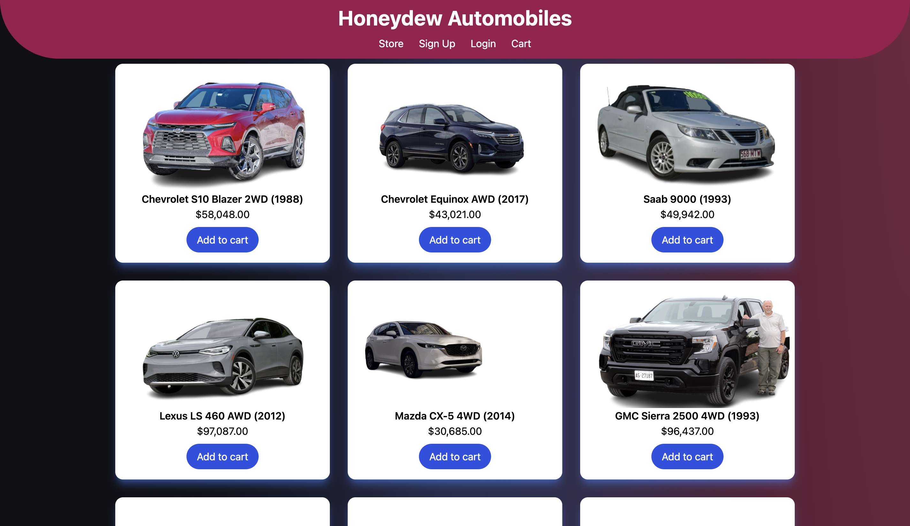

# (Graceshopper Honeydew) Automobile E-commerce Website

## Description

Honeydew automobiles is a basic ecommerce website used to demonstrate CRUD functions. This app is built on the PERN stack and utilizes sequelize, tailwindcss, and framer motion. This project is associated with Fullstack Academy 2202 cohort

Admin account:
 - Username: Bob
 - Password: 123456789

Regular account: 
 - Username: Mary
 - Password: 123456789

## Team behind the project

Elan S: https://github.com/elans-code/

Daniel E: https://github.com/DanCanCode

Ryan C: https://github.com/Cokely13

Zach S: https://github.com/zsonnen
